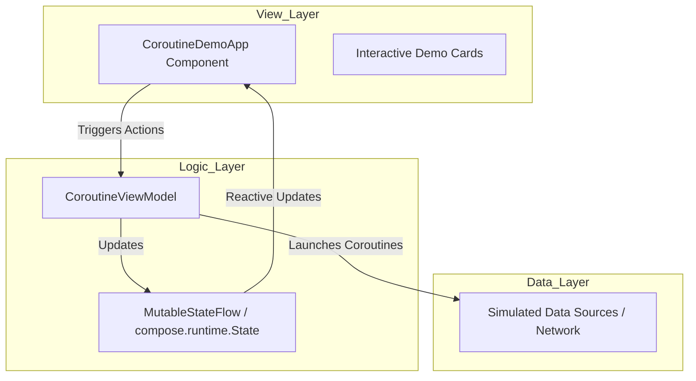
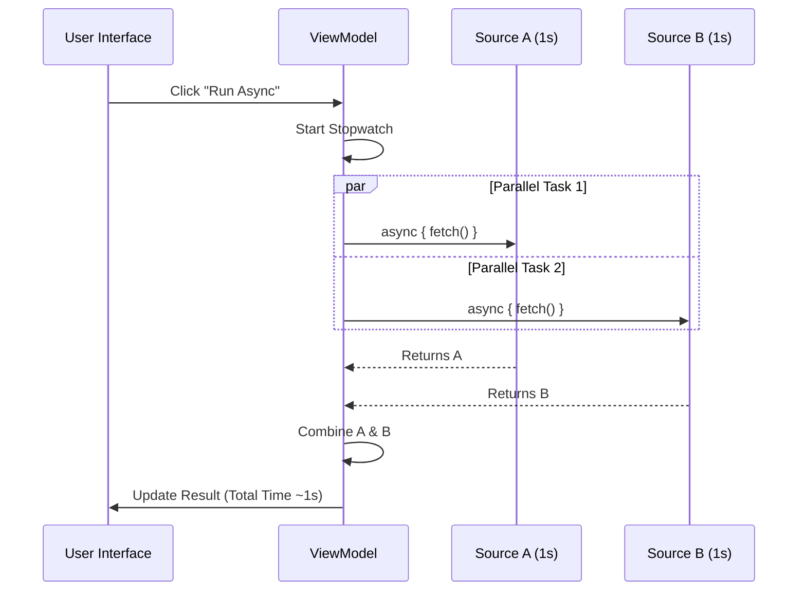

# 🎓 Kotlin Coroutines Academy 🚀

[](https://kotlinlang.org)
[](https://developer.android.com)
[](https://developer.android.com/jetpack/compose)

Welcome to the **Kotlin Coroutines Academy**, a vibrant, interactive playground built to master the art of asynchronous programming on Android. This project is a dedicated educational tool designed to visualize complex coroutine concepts through colorful, interactive, and real-time demonstrations.

---

## 🎨 Visuals & Screenshots

| Main Dashboard | Parallel Async Demo | Flow Visualization |
| :---: | :---: | :---: |
|  |  |  |

---

## 🔥 Key Features

The app is divided into six interactive "Learning Modules," each targeting a core coroutine concept:

1.  **⚡ Basic Launch & Delay**: Sequential task execution with real-time progress bars.
2.  **🔀 Parallel Async/Await**: Demonstrates structured concurrency by running two tasks simultaneously to save time.
3.  **🧵 Dispatchers Playground**: Visualizes thread switching between `Main`, `IO`, and `Default`.
4.  **🌊 Kotlin Flow (Cold Streams)**: A reactive UI example showing live counter and background color updates.
5.  **⏱️ Timeout & Cancellation**: Interactive demonstration of manual job cancellation and automated timeouts.
6.  **⚠️ Exception Handling**: Professional error management using `CoroutineExceptionHandler`.

---

## 🏛️ Architecture: MVVM

This project follows **Modern Android Development (MAD)** practices, strictly adhering to the **MVVM (Model-View-ViewModel)** architecture pattern to ensure separation of concerns and main-safety.

### Architecture Diagram



---

## 📈 MAD Score (Modern Android Development)

| Category | score | details |
| :--- | :--- | :--- |
| **Language** | 100% | 100% Kotlin 2.2.10 |
| **UI** | 100% | 100% Jetpack Compose |
| **Asynchrony** | 100% | Coroutines & Flow only |
| **Architecture** | 90% | MVVM with ViewModel & State |
| **Lifecycle** | 100% | Coroutines scoped to ViewModelScope |

---

## 🛠️ Technology Stack

-   **Kotlin**: The backbone of modern Android development.
-   **Jetpack Compose**: Declarative UI framework for the vibrant, colorful interface.
-   **Coroutines**: For non-blocking, asynchronous task management.
-   **Kotlin Flow**: Reactive data streams for real-time UI updates.
-   **Material 3**: Google's latest design system for consistent and beautiful components.
-   **ViewModel**: Lifecycle-aware state management.

---

## 🌊 Coroutine Flow Logic

### Parallel Execution Flow (Async/Await)

This chart visualizes how `async` blocks run in parallel, reducing total execution time.



---

## 🚀 How to Run

1.  **Clone the repository:**
    ```bash
    git clone https://github.com/yourusername/KotlinCoroutines.git
    ```
2.  **Open in Android Studio:**
    -   Ensure you have the latest version of Android Studio (Ladybug or newer).
3.  **Build and Run:**
    -   Select `:app` and hit the **Run** button.
    -   Works best on devices with API 24+.

---

## 📚 Learning Objectives

-   [x] Understand the difference between `launch` and `async`.
-   [x] Master `withContext` for safe thread switching.
-   [x] Learn to handle `CancellationException` and `TimeoutCancellationException`.
-   [x] Implement `Flow` for real-time reactive streams.
-   [x] Protect the UI from crashes using `CoroutineExceptionHandler`.

---

Created with ❤️ by **[Barış Karapınar]** as a journey into the heart of Kotlin Coroutines.
